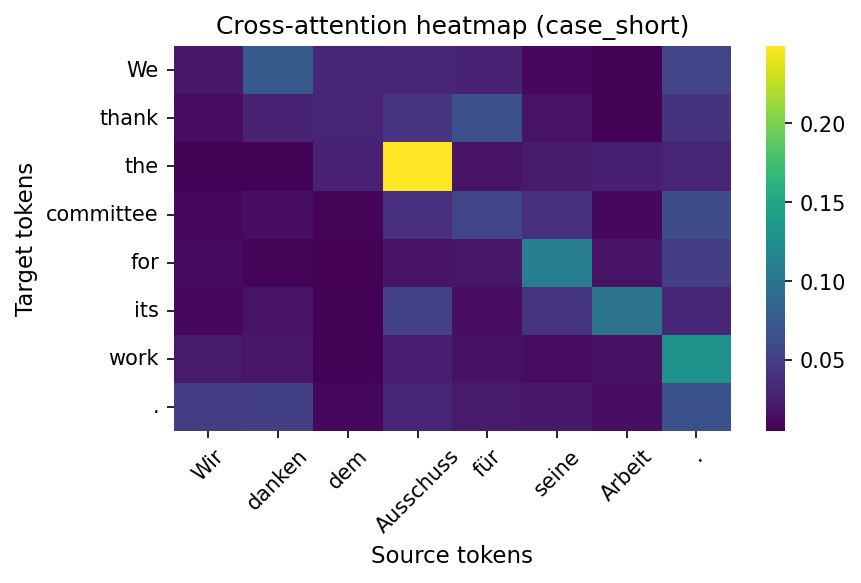
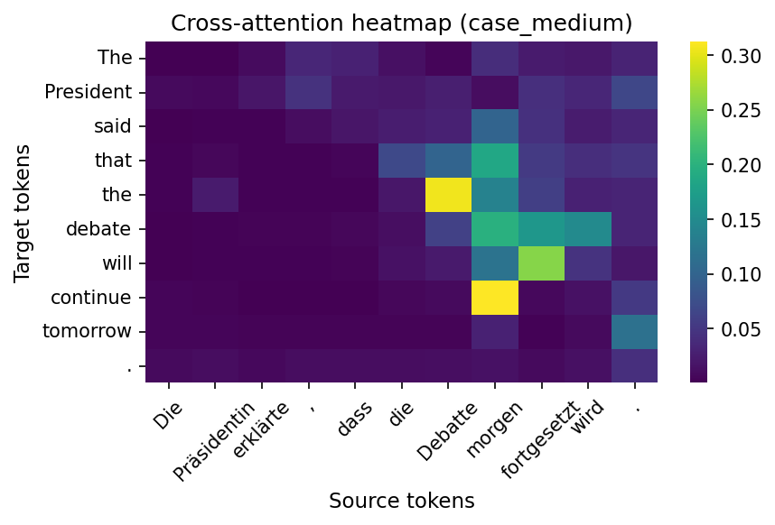
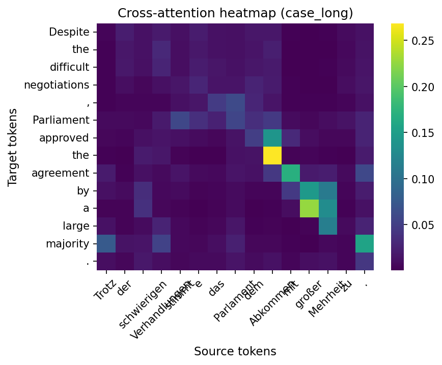

# Domain-Adaptive Neural Machine Translation Pipeline

A production-grade German→English NMT pipeline for parliamentary-domain translation. It covers data preparation, training, inference, evaluation, diagnostics, and decoding strategy search in a single, reproducible workflow.

## Highlights

- End-to-end pipeline with config-driven training, evaluation, and diagnosis
- Single-sentence diagnostics: cross-attention heatmap + low-coverage token highlight + auto label
- Multi-metric evaluation including a semantic metric (BERTScore)
- Fine-tuning configuration to compare pretrained vs. from-scratch models
- ALiBi (relative position bias) option for long-sequence generalization
- Relative-position T5 option (learned position bias) as an alternative baseline
- CI workflow and Dockerfile for quick validation and portability

## Quick Start

```bash
# Install dependencies
pip install -r requirements.txt

# Enter the pipeline directory
cd nmt-pipeline

# Train from scratch
python -m src.train --config configs/train_config.yaml

# Fine-tune a pretrained model
python -m src.train --config configs/finetune_config.yaml

# Train Marian with ALiBi
python -m src.train --config configs/alibi_config.yaml

# Train relative-position T5
python -m src.train --config configs/relative_t5_config.yaml

# Evaluate models (multi-metric)
python -m src.evaluate --config configs/eval_config.yaml

# Dataset-level attention coverage diagnosis
python -m src.diagnose --model-path outputs/my-de-en-nmt --split ood

# Single-sentence diagnosis with heatmap + report
python -m src.diagnose --model-path outputs/my-de-en-nmt \
  --source "Wir danken dem Ausschuss für seine Arbeit." \
  --reference "We thank the committee for its work." \
  --case-id case_short

# Single-sentence diagnosis for T5-style models
python -m src.diagnose --model-path outputs/relative-t5-de-en \
  --source "Wir danken dem Ausschuss für seine Arbeit." \
  --reference "We thank the committee for its work." \
  --source-prefix "translate German to English: " \
  --case-id case_short_t5

# Decode strategy grid search
python -m src.decode_search --config configs/decode_search.yaml

# Generate example heatmaps for README
python scripts/generate_case_studies.py --model-path Helsinki-NLP/opus-mt-de-en

# Generate example heatmaps for T5-style models
python scripts/generate_case_studies.py --model-path outputs/relative-t5-de-en \
  --source-prefix "translate German to English: "

# Run unit tests
python -m unittest discover -s tests
```

## Case Study Visuals

Below are example cross-attention heatmaps generated by `scripts/generate_case_studies.py`.







## Project Structure

```
.
├── .github/
│   └── workflows/
│       └── tests.yml            # CI: run unit tests on push/PR
├── nmt-pipeline/
│   ├── configs/
│   │   ├── train_config.yaml     # Train from scratch
│   │   ├── finetune_config.yaml  # Fine-tune pretrained model
│   │   ├── alibi_config.yaml     # Marian with ALiBi
│   │   ├── relative_t5_config.yaml # Relative-position T5
│   │   ├── eval_config.yaml      # Evaluation settings
│   │   └── decode_search.yaml    # Decoding grid search
│   ├── scripts/
│   │   ├── run_pipeline.sh       # End-to-end pipeline
│   │   └── generate_case_studies.py # Generate example heatmaps
│   ├── src/
│   │   ├── data.py               # Data loading & tokenization
│   │   ├── train.py              # Training engine
│   │   ├── inference.py          # Batched inference & decoding config
│   │   ├── evaluate.py           # Multi-metric evaluation
│   │   ├── metrics.py            # BLEU/ChrF/LengthRatio/BERTScore
│   │   ├── alibi.py              # ALiBi helpers and Marian patching
│   │   ├── diagnose.py           # Coverage diagnosis + single-sentence reports
│   │   ├── error_taxonomy.py     # Error labels & annotation helpers
│   │   └── decode_search.py      # Beam×length penalty search
│   └── tests/
│       ├── test_data.py          # Data pipeline tests
│       └── test_metrics.py       # Metrics tests
├── assets/
│   └── diagnosis/                # Heatmaps and reports
├── Dockerfile
├── requirements.txt
├── TECHNICAL_NOTES.md
└── README.md
```

## Metric Configuration

- `configs/eval_config.yaml` includes `bertscore` by default.
- BERTScore downloads a pretrained model on first run; see `metric_kwargs` for model settings.
- T5-style models require a `source_prefix` (see the `relative_t5` entry in `configs/eval_config.yaml`).
- If you skip the relative-position experiment, remove the `relative_t5` model entry before evaluation.
- ALiBi models use a patched Marian attention module; see `configs/alibi_config.yaml`.
- If you skip ALiBi, remove the `alibi` entry from `configs/eval_config.yaml`.

## CI & Docker

```bash
# CI runs unit tests via .github/workflows/tests.yml

# Build the Docker image
docker build -t nmt-pipeline .

# Run an interactive container
docker run -it nmt-pipeline
```

For deeper design rationale, see `TECHNICAL_NOTES.md`.

---

# 项目说明（中文）

本项目是一个面向德语→英语议会语料的端到端 NMT 流水线，覆盖：数据加载与预处理、模型训练、推理与评估、注意力诊断、解码策略搜索，并提供单句级可视化诊断能力。

## 要点

- 配置驱动的训练、评估与诊断流程
- 单句诊断：cross-attention 热力图 + 低覆盖 token 高亮 + 自动标签
- 多指标评估，包含语义级指标 BERTScore
- 预训练模型微调配置，方便对比 from-scratch 与 fine-tuning
- ALiBi 相对位置偏置方案
- 相对位置编码 T5 方案（作为可选基线）
- CI + Docker 便于快速验证与迁移

## 快速开始

```bash
# 安装依赖
pip install -r requirements.txt

# 进入工程目录
cd nmt-pipeline

# 从零训练
python -m src.train --config configs/train_config.yaml

# 基于预训练模型做微调
python -m src.train --config configs/finetune_config.yaml

# 训练 Marian + ALiBi
python -m src.train --config configs/alibi_config.yaml

# 训练相对位置编码 T5
python -m src.train --config configs/relative_t5_config.yaml

# 多指标评估
python -m src.evaluate --config configs/eval_config.yaml

# 数据集级注意力覆盖诊断
python -m src.diagnose --model-path outputs/my-de-en-nmt --split ood

# 单句诊断（生成热力图与报告）
python -m src.diagnose --model-path outputs/my-de-en-nmt \
  --source "Wir danken dem Ausschuss für seine Arbeit." \
  --reference "We thank the committee for its work." \
  --case-id case_short

# T5 模型单句诊断（需加任务前缀）
python -m src.diagnose --model-path outputs/relative-t5-de-en \
  --source "Wir danken dem Ausschuss für seine Arbeit." \
  --reference "We thank the committee for its work." \
  --source-prefix "translate German to English: " \
  --case-id case_short_t5

# 解码策略搜索
python -m src.decode_search --config configs/decode_search.yaml

# 生成 README 示例图
python scripts/generate_case_studies.py --model-path Helsinki-NLP/opus-mt-de-en

# 生成 T5 示例图（需加任务前缀）
python scripts/generate_case_studies.py --model-path outputs/relative-t5-de-en \
  --source-prefix "translate German to English: "

# 运行单元测试
python -m unittest discover -s tests
```

## 项目结构

```
.
├── .github/workflows/tests.yml      # CI 测试
├── nmt-pipeline/
│   ├── configs/                     # 配置文件
│   │   ├── alibi_config.yaml        # Marian + ALiBi
│   │   ├── relative_t5_config.yaml  # 相对位置编码 T5
│   ├── scripts/                     # 脚本入口
│   ├── src/                         # 核心代码
│   │   ├── alibi.py                  # ALiBi 工具与 Marian patch
│   └── tests/                       # 单元测试
├── assets/diagnosis/                # 热力图与单句报告
├── Dockerfile
├── requirements.txt
├── TECHNICAL_NOTES.md
└── README.md
```

## 说明

- `eval_config.yaml` 默认启用 BERTScore，首次运行会下载预训练模型。
- `scripts/run_pipeline.sh` 支持通过 `RUN_FINETUNE=1` 触发微调步骤。
- 设计决策与面试要点可参考 `TECHNICAL_NOTES.md`。
- T5 相关模型需要 `source_prefix`（参见 `eval_config.yaml` 的 `relative_t5` 条目）。
- 若未训练相对位置模型，请在评估前移除 `relative_t5` 条目。
- ALiBi 模型使用 Marian attention patch（参见 `alibi_config.yaml`）。
- 若未训练 ALiBi 模型，请在评估前移除 `alibi` 条目。
